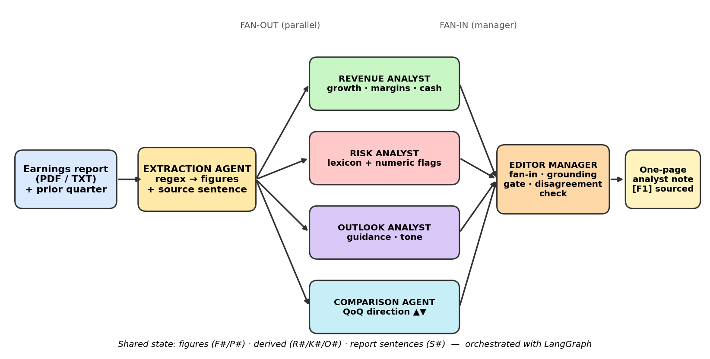
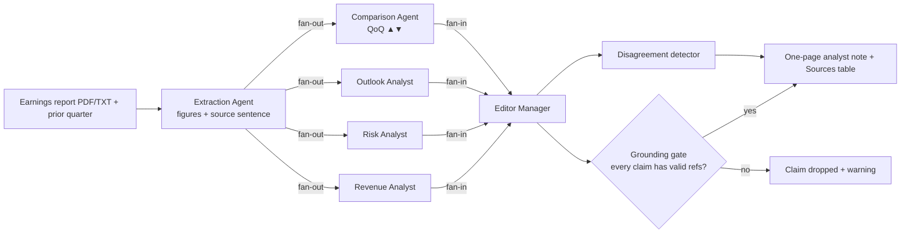

# Workflow diagram

```mermaid
flowchart LR
    R[Earnings report PDF/TXT + prior quarter] --> X[Extraction Agent<br/>figures + source sentence]
    X -->|fan-out| A[Revenue Analyst]
    X -->|fan-out| B[Risk Analyst]
    X -->|fan-out| C[Outlook Analyst]
    X -->|fan-out| D[Comparison Agent<br/>QoQ ▲▼]
    A -->|fan-in| E[Editor Manager]
    B -->|fan-in| E
    C -->|fan-in| E
    D -->|fan-in| E
    E --> G{Grounding gate<br/>every claim has valid refs?}
    G -->|yes| N[One-page analyst note + Sources table]
    G -->|no| W[Claim dropped + warning]
    E --> DIS[Disagreement detector]
    DIS --> N
```
